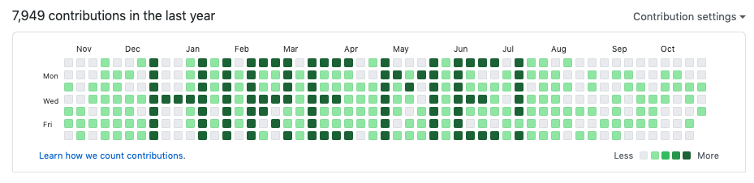
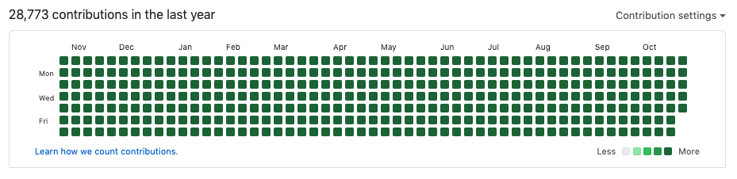
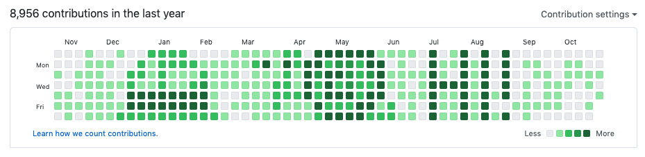
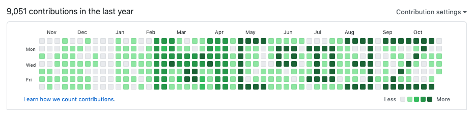

# Vincent van Git
## Use your Github contributions graph as a canvas!

Ever questioned the existence of the Github contributions graph? Looked at it and thought "What does this tell anyone? I work too much? I work too little? Less commits mean less quality work?".

Do you get contribution graph envy? Let Vincent help you!

Vincent van Git is an app for using your Github contributions graph as a canvas.

## Usage

1. Create an empty Github repository.
2. Visit [Vincent](https://vincent-van-git.netlify.app).
3. Configure your settings (Github username, empty repository name, repository branch).
4. Draw the desired image. Left mouse to draw, right mouse to erase. Every cell can be four shades of green.
5. Download the shell script.
6. Run the script!

__Note::__ Avoid generating the script if your profile already has a drawing on it. Delete that repository first. If you don't you'll generate many thousands of commits and it can take some time to run that script. Also, the image might not come out how you expect.

## Why?
This is a project I've wanted to build for some time but wasn't sure how to go about it. I used [gitfiti](https://github.com/gelstudios/gitfiti) for a long time to draw onto my graph. The issue for me? There was no GUI. Creating new images was a process of mapping an Array of nested Array. I could've created a tool to generate that Array for me. But, if I'm going that far, I may as well see if I can build the whole thing. That tool also relied on you entering information into the CLI each time. I wanted to create something accessible that would make it easy for me to create new images.

To summarize, I built a tool to solve a problem for me. And you might enjoy using it too!

Also, why not? It kinda sucks when people question people for doing things they want to. I've learned a bunch from building this project. It's also given me the opportunity to try a variety of different things out. This app actually started as an electron-based app.

## Examples

## How?
Vincent van Git works by pushing empty commits to an empty Github repository. As a user, you draw the image you want on the grid. This equates to an Array of numbers that are either 0, 1, 2, 3, or 4. After configuring your settings, you are able to download the shell script.

Vincent makes checks using a serverless function and gets a commit multiplier. The check consists of making sure the settings are valid. That means that the username exists as does the repository. Also, the repository must be empty. If the checks pass, the function grabs the highest amount of commits per day for the username. The front end uses this to generate a shell script that will commit empty commits to a local repository.

Running the script will create a temporary repo with all the commits and push this for you.

Wait. Be patient. If there are a lot of commits, they take a few minutes to appear on your profile. But, that's it! They're there!

## Under the hood
- ReactJS
- Netlify Serverless Functions
- Tone.js
- react-hook-form
- cheerio
- jsZip
- GreenSock
- luxon
- Parcel
- Stylus
- Pug

## Development
The project uses `Netlify` functions. To run the project use `netlify-cli`.

Install the dependencies with `yarn` and run `netlify dev`. This will give you access to the serverless functions locally. If you're working on something that doesn't concern script generation, use `yarn dev:web`.

## License
MIT

-----
Made with :sparkles: by @jh3y 2020

